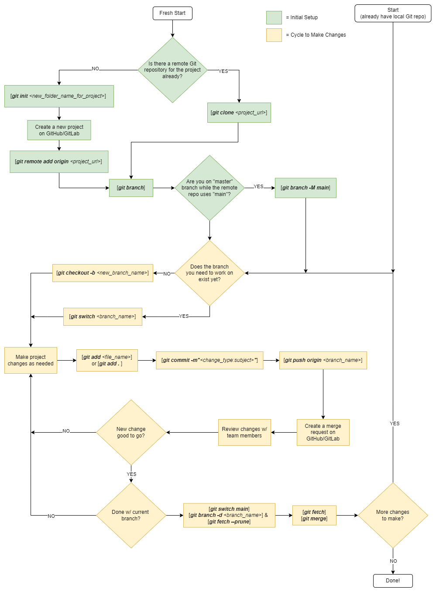

# Git Guide (bare-minimum)
Git is a must-have tool to manage project history and collaborate w/ others. It seems overwheling at first, but there's **very little you need to know** to use Git for its basic purpose. 
- This guide:
    - Assumes Git Bash command line
    - Doesn't cover merge conflicts or rebasing- avoid overlap in work allocation if possible...
    - Uses merge requests & conventional commit messages for good practice

## Index
- **Essentials**
  - [Let's Use Git](#)
  - [Using Git Flowchart](#using-git-flowchart)
  - [Conventional Git Commit Messages](#conventional-git-commit-messages)

- **References and Details**
  - [Important Git Commands](#details-important-git-commands)
  - [Git Jargon](#details-git-jargon)

## Let's Use Git
We want a single working copy of our project online on GitHub/GitLab, let everyone work on different parts of the project at the same time, and track every change that's made on the project. Here's the bare minimum we have to do:

**Initialization**:
- Install Git Bash (and log into GitLab account or create a GitHub account)
- Navigate Git Bash to the directory where you want your project to be (`cd <your_project_path>`)
- If you're contributing to an existing GitHub/GitLab remote repo
  - clone the remote repo using `git clone <project_url>` ->
- If you're making a completely new project
  - Start a new repo via `git init <new_project_directory_name>` ->
  - Create a new project on GitHub/GitLab and get the project URL
    - Make sure to uncheck "Initialize repository with a README" (having this checked will force you to use `git push -f origin <branch_name_w_changes>` to forcefully push your Initial commit and overwrite the initial commit w/ the dummy README)
  - Link the local repo and remote repo w/ `git remote add origin <project_url>` ->
- Switch main branch name to “main” if it’s currently “master”
  - If remote repo works w/ “master” then it’s fine, but if the project is brand new: 
    - Confirm you’re on master branch (`git branch`) ->
    - `git branch -M main` to rename master to main
  - Skipping this step and trying to push changes and renaming the branch later will lead to weird issues- make sure to rename local branch name if needed

**Work Cycle**:
- Create a new branch or switch branches to start making project changes: 
  - `git checkout -b <new_branch_name>` to make a new branch to start making changes
  - `git checkout <branch_name>` or `git switch <branch_name>` if there's already a branch for you to make changes on
- Make changes on the new branch as needed ->
- `git add` to the staging area ->
- `git commit -m“type: subject”` to bundle related changes together: refer to [Conventional Git Commit Messages](#conventional-git-commit-messages) for commit message convention ->
- `git push -u origin <branch_name_w_changes>` to push new branch and associated changes to remote repo
- Repeat above until all changes are done
  - Group relevant changes together into commits
  - Don't stockpile too many unrelated commits into a single merge request
  - Renaming/moving files can be tracked as well- it can be its own commit and merge request
- **Create a Merge Request**:
    - Go to the remote repo on GitHub/GitLab and navigate to the new branch- you'll see your commit and push 
    - Click on "create merge request"
    - Customize the merge request if needed, and create the merge request
    - Review the merge request w/ your team members
    - if the merge request was accepted and the branch was deleted
      - `git fetch --prune` to update local repo w/ the branch deletion 
      - `git branch -d <branch to delete>` to delete the branch locally
      - Confirm that branches were deleted:
        - `git branch`
        - `git branch -r`
- After you're done w/ your changes, make sure to update your local repo w/ your team members' changes: 
  - switch to the main branch w/ `git switch main` if not already on main branch
  - `git fetch` and `git merge` to update local repository w/ others' changes

That's it! Everything you need to know (for now) fits in a page.

Merge conflicts and reverting things gets complicated, so try to allocate work so that team members are working on independent parts of the project.

## Using Git Flowchart
Below is a visual for using Git. 

You do the green stuff once, and continuously repeat the yellow stuff as you work. It's just a handful of commands you need to know on the regular.

## Conventional Git Commit Messages
- To commit w/ a header, body, and footer the command is:
  - `git commit -m “<header>” -m “<body>” -m “<footer>`
- **Header**
  - `<type>(<scope>): <subject>`
  - Ex: `git commit -m“docs(changelog): update changelog to beta.5”`
  - `type`:
      - Must follow below convention to tie w/ *Semantic Versioning*:
        - fix
          - a commit of the type fix patches a bug in your codebase (this correlates with PATCH in Semantic Versioning).
        - feat
          - a commit of the type feat introduces a new feature to the codebase (this correlates with MINOR in Semantic Versioning).
        - BREAKING CHANGE
            - a commit that has a footer BREAKING CHANGE:, or appends a ! after the type/scope, introduces a breaking API change (correlating with MAJOR in Semantic Versioning). A BREAKING CHANGE can be part of commits of any type.
      - **Semantic Versioning**
        - There’s a standard for versioning software (Minecraft’s 1.7.2 wasn’t just some random numbers)
        - The format is Major.Minor.Patch
          - Major
            - Change require user to modify their code/configurations to work w/ new version
            - Fundamentally changes how software works
          - Minor
            - Backward compatible update that adds new features, enhancements, improvements without breaking existing functionality
            - Deprecate a feature but leave it available
            - Minor improvements that don’t require changes from user
          - Patch
            - Backward compatible bug fixes and small improvements that don’t add any new features

  - Possible types include:
    - **fix**
        - bug fix
    - **feat**
        - new feature
    - **build**
      - changes that affect the build system or external dependencies (example scopes: gulp, broccoli, npm)
    - **ci**
      - changes to our CI configuration files and scripts (example scopes: Travis, Circle, BrowserStack, SauceLabs)
    - **docs**
        - documentation only changes
    - **perf**
        - code change that improves performance
    - **refactor**
        - code change that neither fixes a bug nor adds a feature
    - **style**
        - changes that do not affect the meaning of the code (white-space, formatting, missing semi-colons, etc)
    - **test**
         - adding missing tests or correcting existing tests
  - `scope`
    - optional 
    - affected “packages” if there’s a clear scope affected by changes in commit
  - `subject`
    - short description of the change
    - use the imperative, present tense: "change" not "changed" nor "changes"
    - don't capitalize the first letter
    - no dot (.) at the end

- **Body**
  - Just as in the subject, use the imperative, present tense: "change" not "changed" nor "changes". The body should include the motivation for the change and contrast this with previous behavior.
- **Footer**
  - The footer should contain any information about Breaking Changes and is also the place to reference GitHub issues that this commit Closes.
  - Breaking Changes should start with the word “BREAKING CHANGE”: with a space or two newlines. The rest of the commit message is then used for this.

## Details: Git Jargon
Below are Git / version control words that are tossed around:
- Remote repo
  - online repository where working project files are stored and version controlled 
- Working directory / local repo
  - local directory / repository where project files are being modified (on your laptop/PC)
- Staging area
  - where files are stored when you use `git add <files>`
  - space to indicate the modified files that should be packaged into a commit to eventually update the project on the remote repository
  - allows preparation for a commit and eventual push to avoid constantly committing / uncommitting and fighting version history
- Branching
  - method to create a new line of development on a project
  - essential to keep the central repository clean and isolated from each development effort
- Main vs master
  - confusing- it's just the name of the main branch of central repository
  - GitHub goes w/ “main” now by default, but GitLab and raw Git still goes by “master” 
  - it’s just like the effort to change slave/master to client/host, follower/leader, etc
- Head
  - reference to a commit object- the commit in a branch that’s being worked on or viewed in particular
  - when head isn’t pointing to the latest commit (via “git checkout”), the head is “detached”
- Merge request
  - After committing changes to the central repo, you can make a “merge request” before changes are reflected on central repo
  - good to enforce code reviews and record all branch history
- Conventional commits
  - There’s a standard for how to make commit/revision messages
  - Link: https://www.conventionalcommits.org/en/v1.0.0/
  - w/ conventional commits we are barbarians no more
  - allows for easy navigation through Git commit history
- PAT
  - “personalized access token”
   - used to allow users access to API’s, command-line tools, and other automated systems on a version control system
- Merge conflict
  - occurs when you try to merge changes on local repository to central repo, but the central repo has changes on the same files that local repo has changes in
  - must be resolved w/ teammates before any further work
- .gitignore
  - file to specify files that shouldn’t be version controlled
- Fork
  - forking allows you to copy a repo from one Git account to another
- Rebasing
  - “git rebase”
  - method to combine commit history of one branch w/ another branch 
  - useful to avoid merge conflicts 

## Details: Important Git Commands
- `git --version` 
  - check if git installed
- `git init <new_project_directory_name>`
  - **don’t use this command inside of a repo**- that's what submodules are for
  - initializes git repo on local machine
  - creates .git file to manage versioning and history
  - creates a new directory in the directory wherever the cmd /Git Bash currently is w/ the provided directory name
 - `git remote add origin <repo-url>`
    - used to manage how a repository interacts w/ other repositories
    - not often used, but confused w/ `git clone`
    - If local repo created first before remote repo: after creating a remote repo on Gitlab/Github you can link a local repo to the remote repo w/ this command
 - `git clone <project url>`
    - used to copy a remote repository to your local machine if there’s a remote repo for a project already
 - `git status`
    - reports status of Git repo
    - essential- use it often to check Git status (status of commits, staged files, etc)
 - `git log`
    - shows list of commits made to repository
    - includes hash, message, metadata
 - `git branch`
    - displays branches being worked on 
    - `git branch <branch name>` creates a new branch
    - `git switch `switches branches
    - rename a branch
      - `git switch <branch to rename>`, and then `git branch -m <new branch name>`
    - delete branch
      - `git branch -d <branch to delete>`
      - branch currently being viewed (where head is pointing) can’t be deleted
      - you’ll get warned if your branch hasn’t merged w/ central repo yet
  - `git switch <branchname>`
      - switches to new branch
      - `git switch -c <branchname>` creates a new branch if there isn’t a branch named <branchname>
  - `git fetch`
      -  grabs changes in .git directory in remote central repository to prepare to update local repository
      - doesn’t update local repository yet
  - `git merge`
      - used to update local repository when central repo is ahead
      - also used to update central repo if local repo is ahead and no changes were made to central repo otherwise- **use merge requests instead** if you're trying to update the central repo
      - called “fast forward merge”
      - `git switch master`, and then `git merge <branch w/ changes>`
  - `git pull`
      - bad practice- don’t use unless you know it's a fetch & merge
      - updates local repository w/ files fetched w/ `git fetch`
      - same as running `git fetch` and then `git merge` 
      - `git fetch` and then `git merge` gives you better control of the process by showing you what's being fetched from the remote repository before you update your local repository
- `git diff`
  - displays differences between file and branch versions
  - `git diff <branch1> <branch2>`
- `git add <filename>` or `git add . `
  - add new or changed files to the staging area to prepare for a commit
- `git commit`
  - wrap together all desired changes on the staging area to be pushed to the remote repository w/ a commit message
  - refer to **“conventional commit messages”** to follow best commit practices
- `git push -xx origin <branch name>`
  - Push all commits prepared to central (master/main) repository 
  - `git push -u origin <main/master>`
  - Pushes commits to main/master branch called “origin”
  - The -u flag “sets the upstream branch”, meaning that local main branch is tied to remote origin/main branch so that future `git push` and `git pull` will default to this branch specified going forward
  - A -f flag forces the push to overwrite the remote branch w/ local branch ignoring conflicts and changes on remote branch that aren’t on local branch (overwrites remote history w/ local history)

__Undoing changes__
- `git rm --cached <filename>`
  - Remove file from staging area
- `git checkout`
  - Switching branches
      - `git checkout -b <branchname>`
      - Used to switch branches
      - The “-b” flag indicates that a new branch should be created if it doesn’t exist
      - Later comes along `git switch <branchname>` and `git switch -c <branchname>` to switch branches and create new branches, but `git checkout` can do this too
  - Switch to old revision:
      - Switching to old revision of a branch
      - `git checkout <7 digit rev # found w/ git log>` 
      - Commits can’t be made while head is “detached”, but you can make a new branch while the head is detached to then make changes and eventually merge to central repo
- `git restore`
    - Restores a file back to most latest commit
    - Changes that weren’t committed CAN’T be recovered
    - `git restore <filename>`
    - `git restore –source HEAD~<N> <filename>`
    - N is number of commits behind latest commit if we want to go back further
- `git reset`
    - Deletes commits/revisions 
    - `git reset <7 digit rev #>`
      - Moves head pointer to specific rev #
      - Doesn’t change local directory files or staging area
    - `git reset <7 digit rev #> --hard` 
      - Moves head pointer to specific rev #, and modifies local directory to match rev # and clears out staging area
- `git revert` 
    - Undoes work from a particular commit/rev, but doesn’t delete the commit/rev from history
    - Preferred over `git reset` to preserve history
- `git stash`
    - Allows context switching (switching between branches) while you have changes for a particular branch
    - `git stash pop` unstashes the changes to be applied
