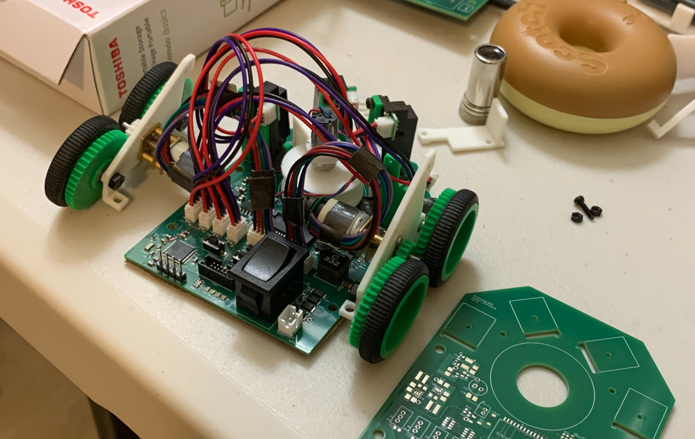

# Mouse 7
This is a public repository for Team Kirbo's micromouse robot. 

Quick migration from private mouse 6 repo to clean repo where we promise to follow good practices and all that jazz.

## Index for repository
- `HELP/`
  - Useful documentation for members and other fellow tinkerers
- `firmware/`
  - Firmware sourrce code (AT32UC3L0256 MCU, ESP32 Bluetooth module, etc)
- `hardware`
  - Hardware reference files (PDFs for schematic, layout, etc)
- `test_software/`
  - Python test files (simulate PID movement control, etc)

# Version History

## 1.0.0
- Initial revision
- Hardware is updated to mouse 7
- Firmware is outdated mouse 6 files
- New Python simulation files to avoid tuning mouse on the spot going forward