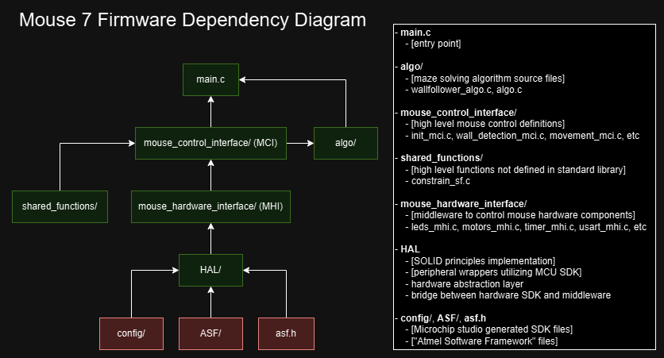
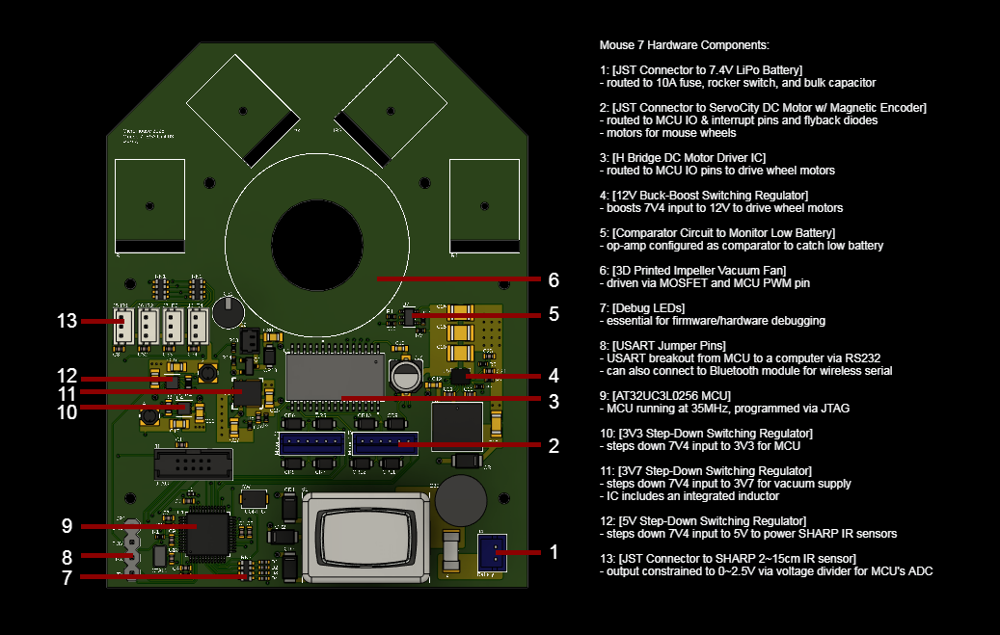
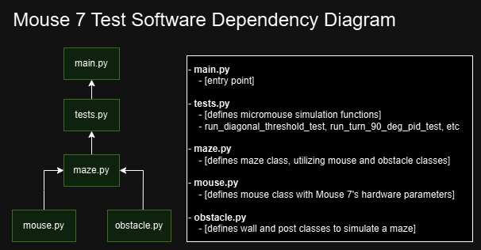

# Micromouse: Mouse 7
This is a public repository for Team Kirbo's micromouse robot for IEEE of Long Island. 

This Micromouse project exists in its current state thanks to:

**Christopher Lobato**
- Implemented PID feedback loop control for the micromouse
- Troubleshooted micromouse firmware/hardware from the start of the project at Stony Brook University
- Helped transition from Arduino Nano to AT32UC3L0256 MCU using Microchip's SDK
- Troubleshooted micromouse firmware/hardware for Mouse 6 
- GOAT- countless hours of pure engineering passion and dedication

**Christopher Freeman**
- Implemented partial flood-fill algorithm from scratch starting mouse 6
- Troubleshooted micromouse firmware for Mouse 6
- GOAT- sharp, patient, and self-driven engineer

**Andy Zhuo**
- Designed a test board for alternatives to SHARP IR sensors to design a custom 3V3 IR sensor w/ similar characteristics to the SHARP sensors
- GOAT- underrated cheesecake enjoyer, can complete any task at hand

**Thomas Montchal**
- Initiated micromouse hardware design from the start of the project at Stony Brook University
- Designed 3D printed mounts for initial Mouse 4
- Helped design circuit for Mouse 4
- GOAT- competent and passionate electrical engineer, vast tinkering repertoire

**Rachel Leong**
- Implemented flood-fill algorithm for Mouse 4 at the start of the project at Stony Brook University 
- GOAT- a bright polymath and powerhouse of engineering

## Mouse 7 Active Team Members:
- Ryuichi Lin
  - Hardware design (schematic / PCB / component selection)
  - Embedded firmware development (drivers, wrappers for higher layers to utilize)
  - Initiate Python simulation effort
- Christopher Lobato
  - PID movement control development
  - Mouse movement development (acceleration/decceleration, diagonal movement via Python Simulation and w/ real hardware)
- Christopher Freeman
  - Mouse maze solving algorithm development (optimization via movement time calculation)
  - ESP32 Bluetooth serial module development (testing/verification before mouse integration)
- Andy Zhuo
  - SHARP IR sensor alternative development (schematic / PCB / component selection)
  - Command line interface development (debugging interface, data collection interface)

This is the continuation of the micromouse journey- everything started in a lab with a handful of engineers and some Monster energy drinks.

## README Index
- [Repository Navigation](#repository-navigation)
- [Current Bot Overview](#current-bot-overview)
- [Work in Progress](#work-in-progress)
- [Version History](#version-history)

## Repository Navigation
- `HELP/`
  - Useful documentation for everyone:
  - Git guide
    - it's easy, and absolutely worth a quick read to use what Git provides at the bare minimum 
  - Doxygen Guide
    - important for standardizing C firmware format, and documentation generation
  - Sphinx Guide
    - important for standardizing Python software format, and documentation generation 
- `firmware/`
  - Firmware sourrce code:
    - AT32UC3L0256 MCU firmware
    - ESP32 Bluetooth module (work in progress)
- `hardware/`
  - 3D printed mount models
  - Mouse 7 hardware reference files:
    - Schematic PDF
    - PCB layout PDF
    - 3D model images
  - Bluetooth module hardware reference files:
    - Schematic PDF
    - PCB layout PDF
    - 3D model images
- `test_software/`
  - Python simulation test files

## Current Mouse Overview
- Below is a high level overview of the current micromouse and its features

### Firmware
- Mouse 7 runs on the AT32UC3L0256 MCU (32-bit AVR32 architecture MCU by Atmel/Microchip)
- Below is a block diagram outlining the firmware structure for (use Doxygen further documentation)

- Green items are written by us, red items are generated via Microchip Studio (hardware specific files)
- Mouse firmware structured to adhere to *SOLID Principles* (link: https://en.wikipedia.org/wiki/SOLID)
- Isolating hardware specific firmware under a **H**ardware **A**bstraction **L**ayer allows for easy plug and play when the time comes for a hardware upgrade or change

### Hardware
- Below is a block diagram outlining the main hardware components of Mouse 7:

- Regarding the power supply circuitry, Texas Instruments has a fantastic tool to generate a circuit for whatever supply you need for your load: https://webench.ti.com/power-designer/
- Mouse 7's 3V3 and 5V circuits were found independent of the tool (Texas Instrument's regulator ICs have great documentation even without the webench tool), but the 12V and 3V7 supply circuits are webench generated, and work just fine

### Test Software
- Due to differences between the competetition maze and practice mazes, there is always a need to tune the mouse for the actual competition maze
- Python simulation software has been written to simulate hardware behavior to optimize mouse movement control and wall detection for any given maze
- Below is a block diagram outlining the test simulation structure (use Sphinx for further documentation)

## Work in Progress
**Full SOLID principles implementation**
- mouse_hardware_interface layer incomplete- remove asf.h dependencies

**Python Simulation**
- simulate move forward PID (both one and two wall cases)

**Additional mouse movement options**
- diagonal movement, acceleration/decceleration, continuous movement

**Bluetooth module**
- verify functionality w/ custom made AT32UC3L0256 breakout board & Sparkfun ESP32 Bluetooth module board

**Serial command line interface**
- complete USART receive firmware for MCU 
- develop commands and appropriate responses to commands

**Maze algorithm updates**
- optimize mouse path for time taken for each type of movement (rotation, move forward, etc)

## Version History
### 1.0.0
- Initial revision
- Hardware is updated to mouse 7
- Firmware is outdated mouse 6 files
- New Python simulation files to avoid tuning mouse on the spot going forward